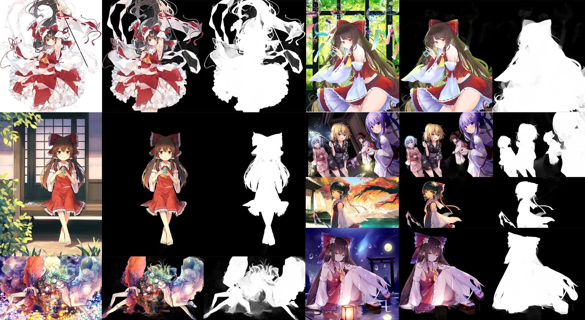

# Anime Segmentation
Segmentation for anime character



## Online Demo

Integrated into [Huggingface Spaces 🤗](https://huggingface.co/spaces) using [Gradio](https://github.com/gradio-app/gradio). Try it out [](https://huggingface.co/spaces/skytnt/anime-remove-background)

## Support Models

[ISNet](https://github.com/xuebinqin/DIS), [U2Net](https://github.com/xuebinqin/U-2-Net), [MODNet](https://github.com/ZHKKKe/MODNet), [InSPyReNet](https://github.com/plemeri/inspyrenet)

## Download Trained Models

Models can be downloaded [here](https://huggingface.co/skytnt/anime-seg)

## Requirements

You need to [install pytorch](https://pytorch.org/) first

Then `pip install -r requirements.txt`

## Train

`python train.py --net isnet_is --data-dir path/to/dataset --epoch 1000 --batch-size-train 10 --batch-size-val 4 --workers-train 10 --workers-val 5 --acc-step 3 --benchmark --log-step 10 --val-epoch 3  --img-size 1024`

detail

```
arguments:
  -h, --help            show this help message and exit
  --net {isnet_is,isnet,u2net,u2netl,modnet,inspyrnet_res,inspyrnet_swin}
                        isnet_is: Train ISNet with intermediate feature supervision,
                        isnet: Train ISNet,
                        u2net: Train U2Net full,
                        u2netl: Train U2Net lite,
                        modnet: Train MODNet
                        inspyrnet_res: Train InSPyReNet_Res2Net50
                        inspyrnet_swin: Train InSPyReNet_SwinB
  --pretrained-ckpt PRETRAINED_CKPT
                        load form pretrained ckpt of net
  --resume-ckpt RESUME_CKPT
                        resume training from ckpt
  --img-size IMG_SIZE   image size for training and validation,
                        1024 recommend for ISNet,
                        384 recommend for InSPyReNet,
                        640 recommend for others,

  --data-dir DATA_DIR   root dir of dataset
  --fg-dir FG_DIR       relative dir of foreground
  --bg-dir BG_DIR       relative dir of background
  --img-dir IMG_DIR     relative dir of images
  --mask-dir MASK_DIR   relative dir of masks
  --fg-ext FG_EXT       extension name of foreground
  --bg-ext BG_EXT       extension name of background
  --img-ext IMG_EXT     extension name of images
  --mask-ext MASK_EXT   extension name of masks
  --data-split DATA_SPLIT
                        split rate for training and validation
  
  --lr LR               learning rate
  --epoch EPOCH         epoch num
  --gt-epoch GT_EPOCH   epoch for training ground truth encoder when net is isnet_is
  --batch-size-train BATCH_SIZE_TRAIN
                        batch size for training
  --batch-size-val BATCH_SIZE_VAL
                        batch size for val
  --workers-train WORKERS_TRAIN
                        workers num for training dataloader
  --workers-val WORKERS_VAL
                        workers num for validation dataloader
  --acc-step ACC_STEP   gradient accumulation step
  --accelerator {cpu,gpu,tpu,ipu,hpu,auto}
                        accelerator
  --devices DEVICES     devices num
  --fp32                disable mix precision
  --benchmark           enable cudnn benchmark
  --log-step LOG_STEP   log training loss every n steps
  --val-epoch VAL_EPOCH
                        valid and save every n epoch
  --cache-epoch CACHE_EPOCH
                        update cache every n epoch
  --cache CACHE         ratio (cache to entire training dataset), higher
                        value require more memory, set 0 to disable cache
```

## Inference

`python inference.py --net isnet_is --ckpt path/to/isnet_is.ckpt --data-dir path/to/input_data --out out --img-size 1024 --only-matted`

## Export model

`python export.py --net isnet_is --ckpt path/to/isnet_is.ckpt --to onnx --out isnet.onnx --img-size 1024`

## Dataset

This dataset is a combined dataset of [AniSeg](https://github.com/jerryli27/AniSeg#about-the-models) and [character_bg_seg_data](https://github.com/ShuhongChen/bizarre-pose-estimator#download).

I clean the dataset using [DeepDanbooru](https://github.com/KichangKim/DeepDanbooru) first then manually, to make sue all mask is anime character.

#### download

```shell
git lfs install
git clone https://huggingface.co/datasets/skytnt/anime-segmentation
cd anime-segmentation
unzip -q 'data/*.zip'
```
